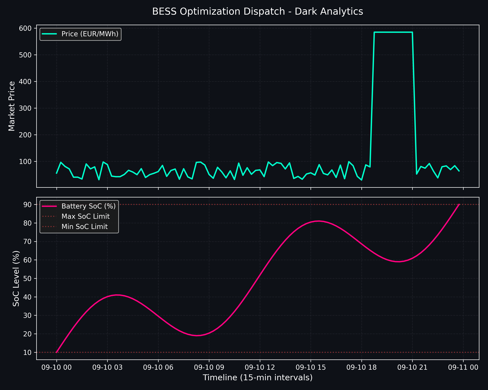
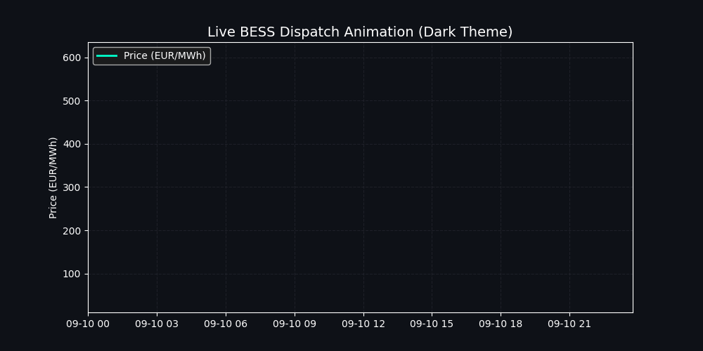

# BESS Optimization Framework

Open-source, lender-grade quantitative dispatch modeling tool designed for European electricity markets (EPEX / ENTSO-E). This framework delivers transparent day-ahead asset optimization, blending real-time price forecasting, degradation tracking, and automated revenue modeling for Battery Energy Storage Systems (BESS).

## Core Capabilities

* **Day-Ahead Price Forecasting**: Integrates SMARD and ENTSO-E datasets to ingest hourly and 15-minute market prices, generating robust feature engineering pipelines with rolling statistical markers and lagged variables.
* **Quantitative Co-Optimization**: Maximizes asset net financial yield through linear programming and constraint-aware dispatch rules, accounting for State of Charge (SoC) bounds and roundtrip efficiency.
* **Automated SQLite Persistence**: Tracks historical predictions against actual market clearing prices to continuously evaluate forecasting accuracy and model drift.
* **Interactive Streamlit Dashboard**: Provides an intuitive UI for real-time asset parameter configuration, live dispatch table auditing, and interactive revenue visualization.

## Visual Pipeline & Analytics

### Market Generation & Thermal Dispatch


### Dynamic Dispatch & Arbitrage Simulation


## Technical Architecture

* **Language**: Python 3.10+
* **Core Libraries**: Pandas, NumPy, Scikit-Learn, Streamlit, Matplotlib
* **Data Storage**: SQLite (local/persistent state management)
* **Market Data**: EPEX Spot / SMARD open-access feeds

## Getting Started

1. Clone the repository and install dependencies:
   ```bash
   pip install -r requirements.txt
